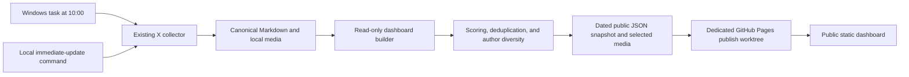

# X-RAG Public Hotspot Dashboard Design

**Date:** 2026-08-10
**Status:** Section designs approved; awaiting final document review
**Audience:** Project owner and implementers

## 1. Summary

Build a public, static GitHub Pages dashboard on top of the existing local X-RAG archive. The dashboard presents a deterministic ranking of the day's strongest AI and Web3 posts in a light, white-first visual design. The existing collector, canonical Markdown archive, local media archive, and RAG search remain the system of record.

The publishing path is intentionally one-way:

1. the local collector writes canonical Markdown and media;
2. a read-only dashboard builder ranks and exports an allowlisted public snapshot;
3. the publisher sends only that generated snapshot and selected media to GitHub Pages.

The dashboard never reads or exposes X authentication cookies, local configuration, local absolute paths, or the Chroma index.

## 2. Goals

- Publish a responsive public dashboard that shows the highest-scoring daily X topics and posts.
- Use the approved white "data cockpit" layout with low-saturation pastel cards.
- Reuse canonical Markdown and downloaded media without changing or deleting source files.
- Update automatically after the existing 10:00 Asia/Singapore collection run.
- Provide a browser refresh control for the latest published snapshot.
- Provide a local one-command collect, build, and publish path for a real immediate update.
- Keep ranking free, deterministic, explainable, and independent of paid AI APIs.
- Fail safely: a failed or empty collection must not replace the last successful public dashboard.

## 3. Non-goals

- The public page will not edit, delete, annotate, or re-index RAG content.
- The public refresh button will not reach into the owner's computer or trigger collection remotely.
- The first version will not use an LLM to rewrite, summarize, translate, or classify posts.
- The first version will not provide user accounts, comments, alerts, or administrative controls.
- The dashboard will not publish every collected post; it publishes only ranked selections.

## 4. Constraints and safety boundaries

- Existing files under the canonical Markdown, import, media, Chroma, and log directories are read-only inputs to the dashboard pipeline.
- The implementation may write only to its documented generated-output and publishing directories.
- No cleanup routine may recursively delete data. Historical dated snapshots and content-addressed media may accumulate.
- Generated site files are project-owned artifacts and may be replaced only at their exact known paths, such as `latest.json`.
- Secrets are denylisted and the public schema is allowlisted. Publishing stops if output contains `auth_token`, `ct0`, environment assignments, or Windows/WSL absolute paths.
- All post text is rendered as text, not injected HTML. External links use safe attributes, and media MIME/type checks occur before export.

## 5. System architecture



### 5.1 Local builder

The builder is integrated with the existing Python package and canonical model instead of maintaining a second parser. It reads the same Markdown front matter and body markers already used by RAG indexing.

Proposed commands:

- `xrag dashboard build` — build a local public snapshot without network publication.
- `xrag dashboard publish` — build and push the latest valid snapshot.
- `xrag dashboard update` — collect, build, validate, and publish for a manual immediate update.

The existing scheduled task is extended to run build and publish only after collection succeeds. It is not replaced by a second competing scheduler.

### 5.2 Static publication

GitHub Pages serves static HTML, CSS, JavaScript, JSON, and selected images. Publication uses a dedicated `gh-pages` branch/worktree so automated data commits do not dirty the development branch or overwrite source code.

The publisher writes:

- a versioned snapshot such as `data/2026-08-10T100500+0800.json`;
- a small `data/latest.json` pointer or latest snapshot document;
- selected media under content-addressed paths such as `assets/media/<sha256>.<ext>`;
- the versioned static application bundle.

Older snapshots and media are not deleted automatically. The public UI references only the latest valid snapshot.

## 6. Candidate selection and hotspot scoring

### 6.1 Time window

- Calendar boundaries use `Asia/Singapore`.
- Prefer posts published during the current local calendar day.
- If fewer than six valid posts exist for the day, expand the candidate window to the preceding 48 hours.
- When fallback posts are used, the UI marks them as "最近 48 小时补充" rather than presenting them as same-day posts.

### 6.2 Deduplication

- Primary identity: canonical post/tweet ID.
- Secondary identity: normalized original post URL.
- Duplicate records retain the most complete canonical representation.

### 6.3 Score

Each component is normalized to `[0, 1]` within the candidate set. The final score is:

```text
score = 0.40 * engagement
      + 0.30 * freshness
      + 0.20 * topic_frequency
      + 0.10 * completeness
```

- **Engagement:** log-normalized views and likes. Views contribute 65% and likes 35% when both exist. Missing metrics cause weights to be redistributed across available metrics rather than treated as negative engagement.
- **Freshness:** a deterministic decay from publication time, reaching zero at the end of the 48-hour candidate window.
- **Topic frequency:** the normalized number of candidate posts assigned to the same configured topic group that day.
- **Completeness:** 50% non-empty body text, 30% valid media, and 20% author/source URL metadata.

Ties are broken by newer publication time and then stable post ID ordering. The visible top 12 allows at most three posts from the same author. The highest-ranked remaining post becomes the lead story.

## 7. Topic groups

The dashboard uses the four already approved collection groups:

1. AI Agents and Agent Security;
2. World Models and Embodied AI;
3. RWA and Stablecoin Payments;
4. Prediction Markets and Crypto Regulation.

Posts may retain multiple source keywords but receive one primary display group using configured group priority and match strength. The UI exposes AI, Web3, newest, and highest-engagement filters.

## 8. Public data contract

The export is constructed from an explicit allowlist. A public post may include only:

- stable public post ID;
- author display name and public handle;
- original text;
- publication timestamp;
- original X URL;
- likes and views when present;
- primary topic and matched public keywords;
- computed score and fallback-window flag;
- public, relative media asset URLs;
- media type and generated accessible alt text derived from the post text.

It must never include:

- `auth_token`, `ct0`, cookies, headers, or environment variables;
- local media paths, WSL paths, Windows paths, usernames, or home directories;
- private collection configuration;
- raw command output, logs, exception traces, or Chroma metadata not present in the public allowlist.

## 9. User experience

### 9.1 Visual language

- White page background with charcoal text.
- Low-saturation pastel cards: pale green, blue, purple, and orange.
- Spacious desktop grid with subtle borders and shadows.
- Single-column responsive layout on narrow screens.
- No dark terminal theme, neon effects, or dense decorative charts.

### 9.2 Page structure

1. **Header:** product title, data date, last successful publication time, and browser refresh button.
2. **Lead story:** top-ranked post with primary image, excerpt, author, timestamp, views, likes, and original link.
3. **Overview cards:** selected hotspot count, unique authors, published media count, and aggregate engagement.
4. **Four topic cards:** topic score, post count, change/strength indicator, and top keyword for each configured group.
5. **Hotspot feed:** top 12 cards with topic and sort filters.
6. **Detail view:** full text, all selected media, metrics, source keywords, publication time, and original X link.

The browser "立即刷新" control cache-busts and re-fetches `latest.json`. It reports whether a newer snapshot was found. It does not claim to trigger a new X collection.

## 10. Media behavior

- Only media attached to selected public posts is exported.
- Assets use content hashes in filenames to avoid collisions and unnecessary recopying.
- Images are lazy-loaded and constrained to responsive dimensions.
- Missing or invalid media produces a pastel placeholder without breaking the card.
- Original post links remain available for source verification.
- Image references in public JSON are relative URLs only.

## 11. Failure handling

- Fewer than one valid candidate, malformed output, failed secret scan, or failed site validation aborts publication.
- Aborted publication leaves the current `latest.json` and live Pages deployment unchanged.
- A stale-data label appears when the latest successful publication is older than the expected daily interval.
- Individual missing media files are isolated to their cards; they do not invalidate an otherwise valid snapshot.
- Push conflicts or unavailable network access produce a local error report and a non-zero exit status. They never invoke destructive Git recovery commands.

## 12. Verification and acceptance criteria

Implementation is complete when all of the following hold:

- Unit tests cover time-window fallback, normalization, score ordering, deduplication, tie-breaking, and per-author caps.
- Parser/export tests use representative canonical Markdown with and without media and metrics.
- Secret-scanning tests prove that credentials and absolute local paths block publication.
- A build smoke test creates a valid static dashboard from fixtures without mutating fixture inputs.
- Front-end tests verify loading, filtering, detail display, refresh behavior, missing-media fallback, and mobile layout basics.
- An empty or failed collection leaves the previous public snapshot intact.
- The scheduled 10:00 pipeline runs collection before build and publication.
- The manual update command performs the same validated sequence on demand.
- The live page contains no private tokens, local paths, or non-allowlisted metadata.
- Existing X-RAG tests continue to pass.

## 13. Approved decisions

- Audience: public, no login.
- Visibility: publish only high-scoring daily hotspots.
- Ranking: deterministic metrics and keyword-based score, no paid AI.
- Update mode: daily 10:00 automatic publication plus a manual immediate-update path.
- Hosting: static GitHub Pages publication from local generated data.
- Layout: option A, data cockpit.
- Palette: white-first with light, low-saturation cards.
- Source safety: no deletion or modification of existing collected content.
